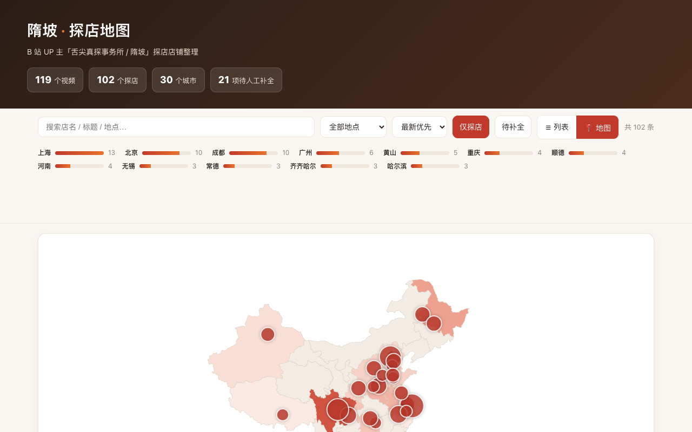

# 隋坡探店地图

> 🌐 在线访问：<https://coreycao.github.io/suipo-tandian-map/>



整理 B 站 UP 主「**舌尖真探事务所 / 隋坡**」（UID `3546888255048212`）所有视频中的**探店店铺**信息，输出结构化 JSON、CSV 与一个可双击打开的静态网页（含**城市聚合地图**视图）。

> 仅供个人整理参考，店铺信息以原视频为准。

## 成果一览

- **119** 个视频 → **102** 个探店，覆盖 **30** 个城市，**21** 项待人工补全。
- 城市 Top：上海(13)、北京(10)、成都(10)、广州(6)、黄山(5)、重庆(4)、顺德(4)、河南(4)、无锡(3)、常德(3)。

## 网页功能（双击 `index.html` 打开）

- **列表视图**：卡片网格，含封面/店名/地点/播放量/置信度/备注，可搜索、按地点/时间/热度筛选。
- **地图视图**（右上「📍 地图」切换）：
  - 中国地图，**省份按探店数暖色着色**（米色→深红，越深越多）。
  - **城市气泡**大小 = 该城探店数；悬停显示城市与店铺清单。
  - **点击气泡**自动切回列表并按该城市筛选；搜索/筛选条件实时同步到地图。
- 底图来自 DataV.GeoAtlas，地图组件 ECharts 走 CDN（打开需联网；离线时自动降级为列表视图）。

## 文件结构

```
suipo-map/
├── index.html                  # 静态网页（数据+地图 GeoJSON 已内嵌，双击即可打开）
├── README.md
├── data/
│   ├── shops.json              # 最终结构化数据（119 条）
│   ├── shops.csv               # 探店导出（102 条，Excel 友好，便于手工补全）
│   ├── manual_overrides.json   # 人工补全补丁（可选，构建时自动叠加）
│   ├── raw_full.json           # 原始 API 缓存（断点续抓用）
│   └── full_run.log            # 全量抓取日志
└── scripts/
    ├── bilibili_api.py         # WBI 签名 + 反爬指纹 + 风控退避重试
    ├── geo_data.py             # 中国行政区划字典（≈400 地名，用于位置识别）
    ├── extract.py              # 探店判定 / 店名提取 / 位置匹配 解析逻辑
    ├── build_site.py           # 生成 index.html（--editor 额外生成本地 editor.html）
    ├── dev.py                  # 本地编辑服务器（起 http 服务 + POST /publish 一键发布）
    ├── china_geo.min.json      # 中国省界 GeoJSON（压缩版，地图底图）
    ├── run_full.py             # 全量抓取（断点续抓）
    ├── run_small_batch.py      # 小范围验证（12 条）
    └── export_csv.py           # 导出 CSV
```

## 数据字段（shops.json）

| 字段 | 说明 |
|---|---|
| `bvid` / `url` | 视频 BV 号与链接 |
| `title` | 视频标题 |
| `cover` | 封面图（已转 https，页面用 no-referrer 绕过防盗链） |
| `is_tandian` | 是否探店 |
| `confidence` | 判定置信度：`high`/`medium`/`low` |
| `shop_name` | 店铺名称（多为标题 `—` 之后；无则 null，见 `note`） |
| `location` / `province` | 城市/地区 与 省份（来自标签里的城市名，无则 null） |
| `location_source` | 位置来源：`tag` / `title` |
| `tags` | 视频标签 |
| `play` / `pubdate` | 播放量 / 发布日期 |
| `note` | 备注：需人工补全的原因 |

## 解析方法（关键信号）

- **店名**：标题 `—`（破折号）之后的部分；若混入「到底/怎么样」等整句词会自动截断。
- **位置**：标签里的城市名（白名单匹配，支持 `北京美食`→`北京` 这类后缀）；标签无则回退扫描标题。
- **探店判定**：标题正面含「探店」/ 有店名 + 美食探店标签 / 有探店标签 + 地点（如「在重庆的肥肠鸡」）。
- **排除**：做饭/教程类（标签含「做饭」等）、标题「不探店」「教你…做法」等。
- 博主**不写简介、不带发布定位**，故位置仅来自标签与标题。

## 如何重新运行

```bash
# 1) 全量抓取（带断点续抓；中断后重跑会跳过已抓项）
python3 scripts/run_full.py              # 加 --refresh 强制重新抓

# 2) 生成网页（默认读 data/shops.json）
python3 scripts/build_site.py

# 3) 导出 CSV（探店；加 --all 含非探店）
python3 scripts/export_csv.py

# 小范围验证（12 条，写到 data/shops_small.json）
python3 scripts/run_small_batch.py --refresh
```

## 关于待人工补全的 21 项

这些是探店但**标题里没有明确店名**（如「特厨探店|济南最出名的老字号？！」）或**没有城市标签**的视频。网页中点「待补全」可单独筛选；CSV 的「备注」列写明了原因，可直接在 Excel 里补全。

## 可视化补全（本地编辑器 + 一键发布）

补全那 21 项不必改 CSV——本地起一个编辑器，浏览器里直接填，填完点「🚀 一键发布」自动构建并推送到 GitHub Pages：

```bash
# 启动本地编辑服务器
python3 scripts/dev.py

# 浏览器打开 http://localhost:8766/
# 编辑 → 点「🚀 一键发布」→ 自动写 overrides → 重建 index.html → git commit && git push
# GitHub Pages 随后自动部署
```

- 编辑器仅在本地 `editor.html`（已 gitignore，绝不部署到公开站点）。
- 编辑自动存浏览器 localStorage，刷新不丢。
- 省份按地点自动填充（顺德/潮汕等待定地名需手填）。
- 填齐后该条变「✓ 已补全」，顶部进度与 hero 统计实时更新。

**只想本地预览（不推送）**：

```bash
python3 scripts/dev.py --no-push   # 或 SUIPO_NO_PUSH=1 python3 scripts/dev.py
```

此模式会写文件 + 构建 + 本地 commit，但跳过 `git push`。之后可手动检查再 push。

**端口**：默认 8766；可通过 `SUIPO_PORT` 环境变量自定义。

> `data/manual_overrides.json` 是「人工层」，按 `bvid` 存补丁，不改动原始 `shops.json`；即便重新抓取也不会覆盖人工补全。
